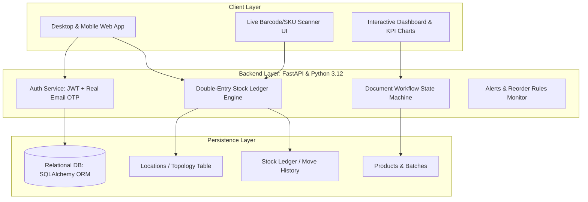
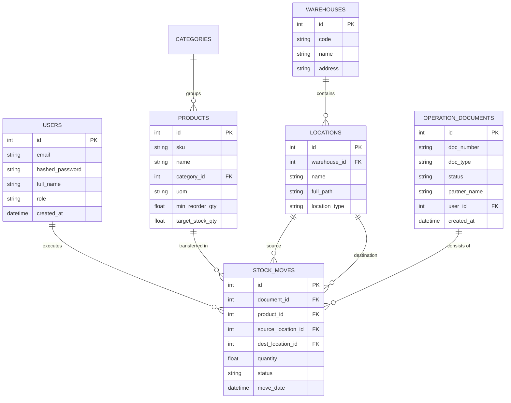

# StockSense - Enterprise Modular Inventory Management System (IMS)
### Comprehensive Product Requirements Document (PRD) & Technical Specification

---

## 1. Project Overview & Vision

**StockSense** is an enterprise-ready, modular Inventory Management System designed to digitize and replace manual registers, error-prone paper slips, and scattered spreadsheets. Modeled after **Odoo's industry-standard double-entry inventory engine**, every unit of stock movement is tracked as a strict ledger transaction between source and destination locations.

### Key Objectives
1. **Zero Stock Discrepancies**: Strict ACID transactional ledger where stock is never updated with arbitrary arithmetic; every count is backed by an auditable move.
2. **End-to-End Traceability**: Full document lifecycle for Incoming Receipts (Vendors), Outgoing Deliveries (Customers), Internal Movements, and Physical Adjustments.
3. **Role-Based Workflows**: Distinct privilege isolation between **Inventory Managers** (strategy, KPIs, reordering thresholds, warehouse topology) and **Warehouse Staff** (fast mobile-friendly picking, packing, receiving, and barcode scanning).
4. **Autonomous Reordering & Alerting**: Real-time evaluation of minimum and maximum safety stocks to prevent stockouts and over-purchasing.

---

## 2. Target Personas & Role-Based Access Control (RBAC)

| Persona | Role Key | Permissions & Scope | Key Daily Workflows |
| :--- | :--- | :--- | :--- |
| **Inventory Manager** | `inventory_manager` | • Full system administration<br>• Executive KPI dashboard & valuation reports<br>• Create/edit products, categories & reordering rules<br>• Multi-warehouse & location configuration<br>• User management & role assignment | Reviews low-stock alerts, approves purchase receipts, analyzes delivery turnaround times, configures warehouse zones. |
| **Warehouse Operator / Staff** | `warehouse_staff` | • Mobile-optimized operational views<br>• Scan / validate incoming goods receipts<br>• Pick, pack, and validate customer delivery orders<br>• Execute internal rack-to-rack transfers<br>• Perform physical inventory audits (adjustments)<br>• *Restricted from high-level financial/executive dashboards* | Scans incoming vendor shipments, moves crates to production racks, picks orders, logs damaged items. |

---

## 3. High-Level Architecture & Technology Stack



### Technology Selections
- **Backend**: Python 3.12, **FastAPI** (asynchronous, high performance, automatic interactive OpenAPI/Swagger docs at `/docs`).
- **ORM & Data Integrity**: **SQLAlchemy 2.0** with strict transactional unit-of-work patterns ensuring no double-spending of inventory.
- **Security & Authentication**: OAuth2 Password Flow + JWT (HMAC-SHA256) + Real OTP delivery service via SMTP/Email.
- **Frontend Presentation**: Premium Vanilla HTML5/CSS3/JavaScript SPA with enterprise Glassmorphism, Google Fonts (`Inter`, `Plus Jakarta Sans`), responsive mobile warehouse layout, and Chart.js analytics.
- **Version Control**: Git on `main` branch with continuous progress pushes to GitHub.

---

## 4. Double-Entry Inventory Engine (The Core Secret)

In conventional crude inventory systems, developers update a column like `products.quantity = products.quantity - 5`. This causes race conditions, phantom inventory, and zero audit trails.

StockSense implements **Double-Entry Stock Accounting**:
$$ \Delta \text{Stock} = \sum \text{Incoming Moves} - \sum \text{Outgoing Moves} $$

### Location Hierarchy & Types
Locations are structured hierarchical paths:
1. **Physical Locations** (Real internal warehouse spaces):
   - `WH1/Main Store` (Raw materials / bulk storage)
   - `WH1/Production Rack` (Assembly floor / active manufacturing)
   - `WH1/Rack A`, `WH1/Rack B` (Shelving units)
   - `WH2/Central Receiving`
2. **Virtual Partner Locations** (External boundaries):
   - `Vendors/Incoming` (Source for vendor receipts)
   - `Customers/Outgoing` (Destination for customer deliveries)
3. **Virtual Inventory Loss Locations**:
   - `Virtual/Loss & Scrap` (Destination for damaged or expired items)
   - `Virtual/Inventory Adjustment` (Balancing location for physical count corrections)

### Transaction Ledger Example

| Movement Type | Source Location | Destination Location | Impact on Physical Stock |
| :--- | :--- | :--- | :--- |
| **Receipt #REC-001** | `Vendors/Incoming` | `WH1/Main Store` | **+100 kg Steel** into Warehouse |
| **Internal Transfer #INT-001** | `WH1/Main Store` | `WH1/Production Rack` | **0 Net Change** (Stock moved internally) |
| **Delivery #DEL-001** | `WH1/Production Rack` | `Customers/Outgoing` | **-20 kg Steel** leaving Warehouse |
| **Damaged Scrap #ADJ-001** | `WH1/Production Rack` | `Virtual/Loss & Scrap` | **-3 kg Steel** written off |

---

## 5. Detailed Feature Specifications

### 5.1. Authentication & OTP Reset Flow
- **Sign In / Registration**:
  - Email, password (hashed with salt), full name, selected role (`inventory_manager` or `warehouse_staff`).
  - Pre-seeded test accounts for instant judging access.
- **OTP Password Reset**:
  - User submits email $\rightarrow$ System generates cryptographically secure 6-digit numeric OTP with 10-minute expiry $\rightarrow$ Dispatches via SMTP email service (with automatic fallback to UI preview modal for testing without email credentials) $\rightarrow$ User submits OTP + new password $\rightarrow$ Session invalidated and password updated.

### 5.2. Executive & Operational Dashboards
- **KPI Metrics Cards**:
  - **Total Products in Stock**: Real-time aggregated inventory count.
  - **Low Stock / Out of Stock Alert Counter**: Items whose stock is $\le$ defined `min_threshold`.
  - **Pending Receipts**: Vendor shipments in `Draft`, `Waiting`, or `Ready` state.
  - **Pending Deliveries**: Customer shipments pending picking or packing.
  - **Internal Transfers Scheduled**: Pending logistics movements across racks.
- **Dynamic Multi-Dimensional Filters**:
  - Filter ledger and lists by Document Type (`Receipt`, `Delivery`, `Internal`, `Adjustment`).
  - Filter by Workflow Status (`Draft`, `Waiting`, `Ready`, `Done`, `Canceled`).
  - Filter by Warehouse / Location (`WH1`, `WH2`, `Production`, etc.).
  - Filter by Product Category (`Raw Materials`, `Finished Goods`, `Components`, `Packaging`).

### 5.3. Product & Catalog Management
- Fields:
  - Product Name (e.g., `Structural Steel Rods 20mm`)
  - Unique SKU / Barcode (e.g., `STL-ROD-020`)
  - Category (`Raw Materials`, `Hardware`, `Electronics`, `Consumables`)
  - Unit of Measure (UoM: `kg`, `units`, `meters`, `liters`, `boxes`)
  - Cost Price & Sale Price
  - Reordering Rules: `min_reorder_qty` (threshold) & `target_stock_qty` (optimal balance)
- Real-time stock breakdown table showing on-hand quantity per warehouse location.

### 5.4. Receipts Workflow (Incoming Vendor Shipments)
```
[1. Create Draft] --> [2. Specify Supplier & Quantities] --> [3. Receive / Ready] --> [4. Validate]
                                                                                           |
                                                                             Ledger Transaction Created:
                                                                         Vendors/Incoming -> WH1/Location
```

### 5.5. Delivery Orders Workflow (Outgoing Goods)
```
[1. Create Sales Order] --> [2. Check Availability] --> [3. Pick Items] --> [4. Pack Items] --> [5. Validate]
                                                                                                      |
                                                                                        Ledger Transaction Created:
                                                                                      WH1/Location -> Customers/Outgoing
```

### 5.6. Internal Transfers (Cross-Location Logistics)
- Move stock inside the business without affecting total company inventory:
  - Example: `WH1/Main Store` $\to$ `WH1/Production Rack`.
  - Validates source location has sufficient quantity before authorizing the transfer.

### 5.7. Physical Stock Adjustments (Cycle Counts & Auditing)
- Used during warehouse audits to align theoretical ledger stock with real physical counts:
  - Staff selects location and product.
  - System shows `Theoretical Recorded Stock: 47`.
  - Staff enters `Counted Stock: 44`.
  - Difference `-3` automatically creates an adjustment move from `WH1/Location` $\to$ `Virtual/Inventory Adjustment Loss` with reason code (e.g., `Damaged in transit`, `Expired`, `Misplaced`).

### 5.8. Stock Ledger & Move History (Audit Trail)
- Immutable chronological transaction record:
  - Timestamp, Document Reference (`#REC-001`, `#DEL-004`), Product SKU & Name, Source Location, Destination Location, Quantity, Operator Username, Status badge.

---

## 6. Database Schema Design (Relational Entities)



---

## 7. Implementation Roadmap & Milestones

1. **Milestone 1 - Core Foundation & Git Remote**:
   - Connect GitHub repository and push baseline configuration, `.gitignore`, and PRD.
2. **Milestone 2 - Database Models & Double-Entry Engine**:
   - Implement SQLAlchemy models (`Product`, `Warehouse`, `Location`, `OperationDocument`, `StockMove`, `User`, `OTPRequest`).
   - Create transactional helper functions that enforce stock integrity.
3. **Milestone 3 - FastAPI RESTful API Endpoints**:
   - Auth & OTP endpoints.
   - Operations API: Receipts, Deliveries, Transfers, Adjustments.
   - Dynamic Filter & Analytics KPIs endpoint.
4. **Milestone 4 - Modern Enterprise Web UI**:
   - Responsive Glassmorphic Dashboard with dark/light themes.
   - Interactive operations forms, pick/pack/validate buttons, live badge updates.
   - Barcode/SKU quick-scanner interface for mobile warehouse staff.
5. **Milestone 5 - Validation, Demo Data & Continuous GitHub Pushing**:
   - Seed realistic demo data matching the problem statement example (100 kg Steel, internal moves, deliveries, adjustments).
   - Test every workflow end-to-end and push completed commits to GitHub.
